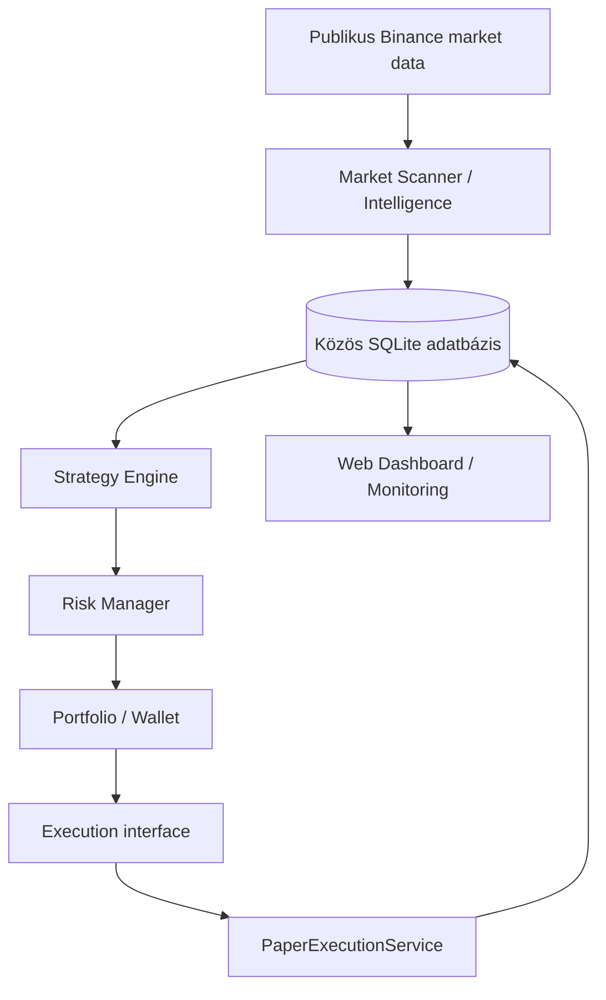

# Crypto Bot — Market Scanner és Paper Trading Core

**v0.2.0 · Binance Spot piaci megfigyelés · auditálható paper trading**

A rendszer publikus Binance market data alapján rangsorolja a piacokat, tárolja a
Market Score történetét, kezeli az automatikus és kézi watchlistet, majd a már mentett
snapshotokból szimulált kereskedési döntéseket hozhat.

**NO LIVE TRADING IMPLEMENTED.** Valódi ordert nem küld. Nincs Binance live execution
adapter, kereskedési API-kulcs, margin, futures, leverage vagy short. A paper account
belső könyvelés, nem valódi crypto wallet. A Market Score és a signal strength nem
profit- vagy nyerési valószínűség.

Az aktuális implementáció a [`feature/trading-core-paper`](https://github.com/feco9308/crypto-bot/tree/feature/trading-core-paper)
branchben található. A telepítési parancsok ezt a branchet használják.
A main branch programkódja még a korábbi verzió; ez a README a kész v0.2.0 rendszert
mutatja be. A részletes dokumentáció és kódlinkek a feature branchre vezetnek.

## Mi működik?

| Terület | Funkciók |
| --- | --- |
| Market Scanner | Spot USDT discovery, piaci szűrés, RSI, EMA, ATR, relative volume |
| Market Intelligence | Market Score, komponensek és indoklás, score history, Δ1h / Δ4h / Δ24h |
| Watchlist | Auto Watchlist, AUTO / WATCH / PINNED / IGNORE override, perzisztált beállítások |
| Paper Core | Strategy Engine, Risk Manager, portfolio, market BUY/SELL szimuláció |
| Könyvelés | Cash-foglalás, fee, slippage, realized/unrealized PnL, exposure, drawdown |
| Kontroll | Paper ON/OFF, stop loss, opcionális take profit, manuális zárás, megerősített reset |
| Web és monitoring | Scanner, Paper Trading, Services, heartbeat, health API, system events |
| Tárolás | Közös SQLite adatbázis, WAL, verziózott Alembic migrációk, trade audit trail |

## Architektúra



A scanner, a web és a paper engine külön folyamat. A Strategy Engine, Risk Manager és
Portfolio belső komponensek. A paper engine a már eltárolt scanner snapshotokat olvassa;
a web és a stratégia nem indít új Binance adatlekéréseket. Csak az execution réteg
hajthat végre ordert, és jelenleg kizárólag helyi paper implementáció létezik.

**Egy production adatbázishoz egy scanner és egy paper engine fusson.**

## Új telepítés

Ubuntu 24.04+, Python 3.11 vagy újabb. Ezek a lépések új checkouthoz készültek;
meglévő production `.env`-et vagy adatbázist ne írj felül velük.

```bash
sudo apt update
sudo apt install -y git python3 python3-venv

git clone --branch feature/trading-core-paper --single-branch \
  https://github.com/feco9308/crypto-bot.git
cd crypto-bot
python3 -m venv .venv
.venv/bin/python -m pip install -r requirements.txt
.venv/bin/python -m pip install -e .
cp .env.example .env
chmod 600 .env
```

Indítás előtt szerkeszd a `.env` fájlt:

- `SCANNER_DATABASE_URL`: productionben abszolút SQLite útvonalat használj.
- `SCANNER_SECRET_KEY`: tartós véletlen kulcs, amely minden web worker számára azonos.
- `WEB_HOST=0.0.0.0`, `WEB_PORT=8000`: alapértelmezett LAN bind.

Kulcs generálása: `.venv/bin/python -c 'import secrets; print(secrets.token_hex(32))'`.
Az eredményt a saját `.env` fájlodba írd, ne commitold.

Példa ezen a szerveren:

```dotenv
SCANNER_DATABASE_URL=sqlite:////home/ndvi/crypto-bot/data/market.db
WEB_HOST=0.0.0.0
WEB_PORT=8000
```

A relatív default `sqlite:///data/market.db` a munkakönyvtárhoz képest értendő.
Minden folyamat ugyanazt a `.env`-et és DB útvonalat használja.

```bash
.venv/bin/market-scanner migrate
.venv/bin/market-scanner paper init
.venv/bin/market-scanner paper status
.venv/bin/market-scanner scan --once
```

Az új paper account **1000 USDT és TRADING OFF** állapotból indul. A `paper init`
idempotens; meglévő accountot nem resetel és nem kapcsol automatikusan OFF-ra.
A `migrate` a scanner és a paper sémát is létrehozza. Az `init-db` önmagában csak a
scanner tábláit inicializálja; a web/scanner indítása nem helyettesíti a migrációt.

## Fejlesztői indítás

Ugyanabból a repository gyökérből, külön terminálokban:

```bash
.venv/bin/market-scanner scan
.venv/bin/market-scanner paper run
.venv/bin/market-scanner web
```

A scanner az aktuális futás befejezése után alapból 300 másodpercet vár. A paper engine
alapból 15 másodpercenként dolgozik. SIGINT/SIGTERM szabályos leállítást kér.
Az engine elindítása **nem kapcsolja ON-ra a tradinget**; az ON/OFF állapot a DB-ben él.

A fejlesztői web is `0.0.0.0:8000` címen figyel. LAN: `http://SZERVER_IP:8000`;
helyben: `http://127.0.0.1:8000`. Egyedi bind:

```bash
.venv/bin/market-scanner web --host 0.0.0.0 --port 8080
```

Production webhez Gunicorn:

```bash
.venv/bin/gunicorn --config gunicorn.conf.py 'crypto_bot.web.app:create_app()'
```

A közös Gunicorn konfiguráció a `WEB_HOST` / `WEB_PORT` értékeket használja, két workerrel.

## Konfiguráció

Források: beépített alapértékek → opcionális JSON config → environment.
A `.env` csak a még nem beállított környezeti változókat tölti be.

| Réteg | Példák / konfiguráció |
| --- | --- |
| Scanner | `SCANNER_TIMEFRAME=1h`, `SCANNER_NUMBER_OF_MARKETS=50`, `SCANNER_SCANNER_INTERVAL=300` |
| Scanner JSON | `SCANNER_CONFIG=config/scanner.json`; [minta](https://github.com/feco9308/crypto-bot/blob/feature/trading-core-paper/config/scanner.example.json) |
| Web | `WEB_HOST=0.0.0.0`, `WEB_PORT=8000`, `SCANNER_SECRET_KEY` |
| Paper | `PAPER_<FIELD>`; például `PAPER_RISK_PER_TRADE_PCT=0.5` |
| Paper JSON | `PAPER_CONFIG=config/paper.json`; [minta](https://github.com/feco9308/crypto-bot/blob/feature/trading-core-paper/config/paper.example.json) |
| Monitoring | heartbeat 30s, stale threshold 120s, event retention 500 rekord |

A teljes env minta: [.env.example](https://github.com/feco9308/crypto-bot/blob/feature/trading-core-paper/.env.example).
Scanner mezők: [settings.py](https://github.com/feco9308/crypto-bot/blob/feature/trading-core-paper/crypto_bot/config/settings.py);
paper mezők: [trading/config.py](https://github.com/feco9308/crypto-bot/blob/feature/trading-core-paper/crypto_bot/trading/config.py).
A scanner listái és súlyai JSON-ként adhatók meg. Az időbélyegek UTC-ben tárolódnak és jelennek meg.

## Paper stratégia és risk

A referencia-stratégia a pipeline ellenőrzésére készült, profitoptimalizálás nélkül.
Alap BUY feltételek: effective WATCH/PINNED, score ≥70, elérhető Δ4h ≥0,
EMAfast > EMAslow, RSI 40–70, relative volume ≥1. Stop: entry reference − 2×ATR.
Hiányzó momentum esetén alapból HOLD. A küszöbök konfigurálhatók.

| Paper alapérték | Érték |
| --- | --- |
| Kezdő balance | 1000 USDT |
| Risk / trade | 0.5% equity |
| Max nyitott pozíció | 3 |
| Max total / symbol exposure | 50% / 20% |
| Daily loss / max drawdown limit | 2% / 5% |
| Minimum order value | 10 USDT |
| Fee / slippage | 0.1% / 0.05% |
| Pyramiding | false; több pozíció ugyanarra a symbolra nem támogatott |

A Risk Manager stop-distance alapján méretez, fee/slippage figyelembevételével,
majd cash és exposure limitekkel korlátozza a méretet. A döntés és indoklása mentésre kerül.
A portfolio külön kezeli a cash, reserved/available cash, PnL, fee és drawdown értékeket.
A pénzügyi értékek Decimal-alapúak.

**Ármodell:** a paper fill friss scanner snapshot záróárából készül, adverse slippage-pel.
Nincs tick stream vagy intrabar stop; gap esetén a veszteség meghaladhatja a tervezett risket.
Friss ár nélkül nincs kitalált fill, a manuális zárás is friss snapshotot igényel.
Az OFF alatt feldolgozott snapshot ON után nem kerül újra feldolgozásra.

Részletek: [Paper Trading — stratégia, risk és könyvelés](https://github.com/feco9308/crypto-bot/blob/feature/trading-core-paper/docs/PAPER_TRADING.md).
A [Market Scanner dokumentáció](https://github.com/feco9308/crypto-bot/blob/feature/trading-core-paper/docs/MARKET_SCANNER.md) tartalmazza a változatlan
score-képleteket, momentum-számítást, adatminőségi és watchlist szabályokat.

## Dashboard és monitoring

| Útvonal | Tartalom |
| --- | --- |
| `/` | Market Scanner, rangsorok, watchlist, override, instrument history |
| `/paper` | Portfolio, open positions, trade/signal history, audit, ON/OFF, manual close |
| `/services` | Szolgáltatások és belső komponensek, heartbeat, success/error, verzió, git metadata |
| `/health` | Rövid, secret nélküli health válasz, HTTP 200 vagy 503 |
| `/api/system/status` | Részletes system status, DB schema/migration verzió és események |
| `/api/markets`, `/api/history/<symbol>` | Scanner read-only JSON adatok |

ENGINE RUNNING és TRADING OFF egyszerre érvényes állapot. OFF mellett új pozíció
nem nyílhat; meglévő pozíciók frissítése, stop/exit és manuális zárás működhet.
Az ON/OFF, override és close műveletek CSRF-védett POST kérések.

A hosszú életű scanner/paper process valódi, perzisztált heartbeatet ír. Régi heartbeat
STALE státuszt okoz. Egy instrumentum hibája részleges scanner ciklust és DEGRADED
figyelmeztetést eredményezhet; nem feltétlenül teljes ERROR. Példa: HYPEUSDT —
`Need at least 400 closed candles`. A system events tárolása korlátozott.

A dashboard egy operátori felület, saját bejelentkezés nélkül. Ezen a szerveren az
Nginx Proxy Manager access control védi a domaint. A proxy célja a szerver LAN IP-je
és port 8000; `0.0.0.0` a bind cím. Hitelesítés nélküli domain-kérés HTTP 401-et adhat.

## Adatbázis, backup és frissítés

Scanner táblák: instruments, scanner_runs, snapshots, decisions, overrides, override_events.
Paper táblák: paper_account, strategy_signals, risk_decisions, paper_orders, paper_fills,
paper_positions, paper_portfolio_snapshots, paper_processed_snapshots.
Monitoring: service_status, system_events.

Az auditkapcsolat: scanner snapshot → signal → risk decision → order → fill → position.
SQLite WAL, foreign keys és 30s busy timeout aktív. Alembic:
`0001_scanner → 0002_paper`; a scanner kompatibilitási `schema_version` értéke továbbra is 1.

Meglévő éles rendszer frissítése előtt készíts konzisztens mentést, jegyezd fel a
row countokat és override-okat, próbáld ki a migrációt a mentés másolatán, majd
szabályosan állítsd le a DB-t író szolgáltatásokat. A meglévő `.venv` megtartható.
A migráció után integrity check, adategyezőség és scanner `scan --once` próbakör szükséges.

Aktív WAL adatbázisnál SQLite backup API-t használj, ne csak a `.db` fájlt másold:

```python
import sqlite3
source = sqlite3.connect('file:/ABS/PATH/market.db?mode=ro', uri=True)
target = sqlite3.connect('/ABS/PATH/market-backup-YYYYMMDD-HHMMSS.db')
source.backup(target)
assert target.execute('PRAGMA integrity_check').fetchone()[0] == 'ok'
target.close()
source.close()
```

A scanner historyt és override-okat sem migráció, sem paper reset nem törli.
Automatikus scanner/paper history retention és ütemezett backup jelenleg nincs.
PostgreSQL production használata még nem validált.

A 2026-10-05-i éles átállítás és rollback leírása:
[Production migration report](https://github.com/feco9308/crypto-bot/blob/feature/trading-core-paper/docs/PRODUCTION_MIGRATION.md).
Az audit pillanatában 96→99 run, 4704→4851 snapshot, mind a négy override megmaradt;
a gyűjtés azóta folytatódik. A korábbi GitHub push hitelesítési hibát SSH-ra váltással
megoldottuk, a feature branch feltöltése sikeres.

## Tesztek és további dokumentáció

```bash
.venv/bin/python -m pip install -r requirements-dev.txt
.venv/bin/pytest -q
```

A production migráció validációjakor **98 teszt sikeres**: scanner regresszió,
paper signal/risk/portfolio/execution, reset, persistence, migráció, monitoring és web.
A tesztek izolált, determinisztikus adatokat használnak, nem élő Binance API-t.

- [Scanner audit](https://github.com/feco9308/crypto-bot/blob/feature/trading-core-paper/docs/AUDIT.md), [scanner validáció](https://github.com/feco9308/crypto-bot/blob/feature/trading-core-paper/docs/VALIDATION.md)
- [Paper architektúraterv](https://github.com/feco9308/crypto-bot/blob/feature/trading-core-paper/docs/PAPER_PLAN.md), [paper validáció](https://github.com/feco9308/crypto-bot/blob/feature/trading-core-paper/docs/PAPER_VALIDATION.md)
- [Éles migrációs riport](https://github.com/feco9308/crypto-bot/blob/feature/trading-core-paper/docs/PRODUCTION_MIGRATION.md)

Az auditok és validációs riportok a készítésük idején fennálló állapotot rögzítik;
az aktuális indítási és üzemeltetési útmutató ez a README.
A `legacy/` az eredeti programokat őrzi. A legacy RSI/EMA stratégia külön maradt;
a régi config/CSV alapú programokat ne használd az új platform indítására.

Következő mérföldkő: paper ledger reconciliation és tartós megfigyelés,
pontosabb ármodell, OHLCV/spread archiválás, history retention és ütemezett backup.

## OPERATIONS — jelenlegi production szerver

| Elem | Production beállítás |
| --- | --- |
| Checkout | `/home/ndvi/crypto-bot` |
| Branch | `feature/trading-core-paper` |
| SQLite | `/home/ndvi/crypto-bot/data/market.db` |
| Web | Gunicorn, `0.0.0.0:8000`, `https://crypto.vagilak.hu` |
| Futási mód | **ndvi felhasználói systemd**, `linger=yes` |
| Unitok | `crypto-market-scanner`, `crypto-web`, `crypto-paper` |

A szolgáltatások terminálbezárás után is futnak és bootkor indulnak. Mindhárom azonos
checkoutból és közös DB-vel dolgozik. A `/home/ndvi/crypto-bot-paper` fejlesztési checkout;
a korábbi 8001-es preview nem production. A migráció után a paper trading OFF maradt;
a mindenkori állapotot a status parancs mutatja, service restart megőrzi azt.

```bash
# STATUS
systemctl --user status crypto-market-scanner crypto-web crypto-paper
systemctl --user is-enabled crypto-market-scanner crypto-web crypto-paper
loginctl show-user ndvi -p Linger

# START / STOP / RESTART
systemctl --user start crypto-market-scanner crypto-web crypto-paper
systemctl --user stop crypto-paper crypto-web crypto-market-scanner
systemctl --user restart crypto-web

# LOG
journalctl --user -u crypto-market-scanner -f
journalctl --user -u crypto-web -f
journalctl --user -u crypto-paper -f

# PAPER
cd /home/ndvi/crypto-bot
.venv/bin/market-scanner paper status
.venv/bin/market-scanner paper off
# Csak tudatos operátori engedélyezéskor:
.venv/bin/market-scanner paper on
# Manuális zárás a dashboardon látható position ID-val:
.venv/bin/market-scanner paper close --position 1

# RESET — csak a paper ledger; előbb engine stop
.venv/bin/market-scanner paper off
systemctl --user stop crypto-paper
.venv/bin/market-scanner paper reset --confirm RESET-PAPER
systemctl --user start crypto-paper

# WEB BIND / HEALTH
ss -ltnp | grep :8000
curl http://127.0.0.1:8000/health
```

### User unitok telepítése ezen a szerveren

A minták a fenti abszolút útvonalakhoz készültek. Más gépen előbb igazítsd őket;
telepítés előtt állítsd le az esetleges régi/helper folyamatokat, hogy ne legyen duplikáció.

```bash
mkdir -p ~/.config/systemd/user
cp deploy/user/*.service ~/.config/systemd/user/
systemctl --user daemon-reload
loginctl enable-linger ndvi
systemctl --user enable --now crypto-market-scanner crypto-web crypto-paper
```

A user unitok az ndvi user manager identitását öröklik. A system
`network-online.target` nem kapcsolható hozzájuk; hálózati hiba után a scanner
következő ciklusban újrapróbálkozik.

### Opcionális váltás rendszerszintű systemdre

A [system unit minták](https://github.com/feco9308/crypto-bot/tree/feature/trading-core-paper/deploy/) explicit `User=ndvi`, megfelelő working directory,
venv, network-online dependency, restart és journald beállításokat tartalmaznak.
Adminisztrátori váltás:

```bash
sudo /home/ndvi/crypto-bot/scripts/install-production-systemd.sh
# Váltás UTÁN már --user nélkül:
systemctl status crypto-market-scanner crypto-web crypto-paper
sudo systemctl restart crypto-web
journalctl -u crypto-market-scanner -f
```

A telepítő először leállítja/letiltja a user unitokat, majd engedélyezi a system unitokat.
Ne futtasd egyszerre a két unitkészletet. A [background helper](https://github.com/feco9308/crypto-bot/blob/feature/trading-core-paper/scripts/background.sh)
fejlesztési alternatíva; ne indíts vele process-t a systemd által kezelt mellé.

A megőrzött migration backupok és a részletes `ROLLBACK.md` helye:
`/home/ndvi/crypto-bot-backups/20261005-194519-UTC/`.
