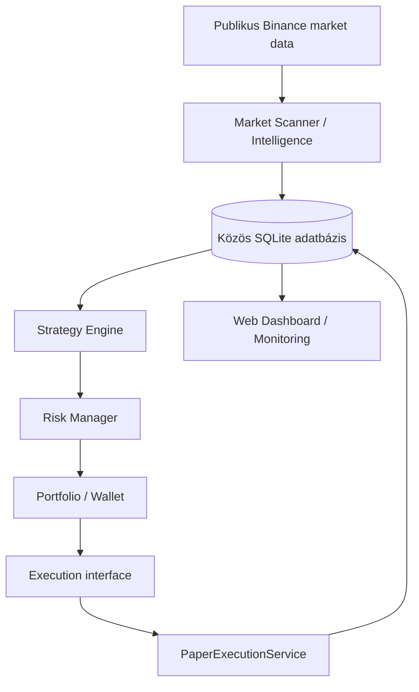

# Crypto Bot — Market Scanner és Paper Trading Core

**v0.2.0 · Binance Spot piaci megfigyelés · auditálható paper trading**

A rendszer publikus Binance market data alapján rangsorolja a piacokat, tárolja a
Market Score történetét, kezeli az automatikus és kézi watchlistet, majd a már mentett
snapshotokból szimulált kereskedési döntéseket hozhat.

**NO LIVE TRADING IMPLEMENTED.** Valódi ordert nem küld. Nincs Binance live execution
adapter, kereskedési API-kulcs, margin, futures, leverage vagy short. A paper account
belső könyvelés, nem valódi crypto wallet. A Market Score és a signal strength nem
profit- vagy nyerési valószínűség.

Az aktuális implementáció a [`feature/trading-core-paper`](https://github.com/feco9308/crypto-bot/tree/feature/trading-core-paper)
branchben található. A telepítési parancsok ezt a branchet használják.

## Mi működik?

| Terület | Funkciók |
| --- | --- |
| Market Scanner | Spot USDT discovery, piaci szűrés, RSI, EMA, ATR, relative volume |
| Market Intelligence | Market Score, komponensek és indoklás, score history, Δ1h / Δ4h / Δ24h |
| Watchlist | Auto Watchlist, AUTO / WATCH / PINNED / IGNORE override, perzisztált beállítások |
| Paper Core | Strategy Engine, Risk Manager, portfolio, market BUY/SELL szimuláció |
| Könyvelés | Cash-foglalás, fee, slippage, realized/unrealized PnL, exposure, drawdown |
| Kontroll | Paper ON/OFF, stop loss, opcionális take profit, manuális zárás, megerősített reset |
| Web és monitoring | Scanner, Paper Trading, Services, heartbeat, health API, system events |
| Tárolás | Közös SQLite adatbázis, WAL, verziózott Alembic migrációk, trade audit trail |

## Architektúra



A scanner, a web és a paper engine külön folyamat. A Strategy Engine, Risk Manager és
Portfolio belső komponensek. A stratégia a már eltárolt, lezárt **1h** scanner snapshotokat olvassa. A paper engine
külön publikus bookTicker quote-ot kér a fillhez, stop/TP ellenőrzéshez és markhoz.
A web GET nézetei nem kérnek market data-t; a manuális close POST friss quote-ot kér. Csak az execution réteg
hajthat végre ordert, és jelenleg kizárólag helyi paper implementáció létezik.

**Egy production adatbázishoz egy scanner és egy paper engine fusson.**

## Új telepítés

Ubuntu 24.04+, Python 3.11 vagy újabb. Ezek a lépések új checkouthoz készültek;
meglévő production `.env`-et vagy adatbázist ne írj felül velük.

```bash
sudo apt update
sudo apt install -y git python3 python3-venv

git clone --branch feature/trading-core-paper --single-branch \
  https://github.com/feco9308/crypto-bot.git
cd crypto-bot
python3 -m venv .venv
.venv/bin/python -m pip install -r requirements.txt
.venv/bin/python -m pip install -e .
cp .env.example .env
chmod 600 .env
```

Indítás előtt szerkeszd a `.env` fájlt:

- `SCANNER_DATABASE_URL`: productionben abszolút SQLite útvonalat használj.
- `SCANNER_SECRET_KEY`: tartós véletlen kulcs, amely minden web worker számára azonos.
- `WEB_HOST=0.0.0.0`, `WEB_PORT=8000`: alapértelmezett LAN bind.

Kulcs generálása: `.venv/bin/python -c 'import secrets; print(secrets.token_hex(32))'`.
Az eredményt a saját `.env` fájlodba írd, ne commitold.

Példa ezen a szerveren:

```dotenv
SCANNER_DATABASE_URL=sqlite:////home/ndvi/crypto-bot/data/market.db
WEB_HOST=0.0.0.0
WEB_PORT=8000
```

A relatív default `sqlite:///data/market.db` a munkakönyvtárhoz képest értendő.
Minden folyamat ugyanazt a `.env`-et és DB útvonalat használja.

```bash
.venv/bin/market-scanner migrate
.venv/bin/market-scanner paper init
.venv/bin/market-scanner paper status
.venv/bin/market-scanner scan --once
```

Az új paper account **1000 USDT és TRADING OFF** állapotból indul. A `paper init`
idempotens; meglévő accountot nem resetel és nem kapcsol automatikusan OFF-ra.
A `migrate` a scanner és a paper sémát is létrehozza. Az `init-db` önmagában csak a
scanner tábláit inicializálja; a web/scanner indítása nem helyettesíti a migrációt.

## Fejlesztői indítás

Ugyanabból a repository gyökérből, külön terminálokban:

```bash
.venv/bin/market-scanner scan
.venv/bin/market-scanner paper run
.venv/bin/market-scanner web
```

A scanner az aktuális futás befejezése után alapból 300 másodpercet vár. A paper engine
alapból 15 másodpercenként dolgozik. SIGINT/SIGTERM szabályos leállítást kér.
Az engine elindítása **nem kapcsolja ON-ra a tradinget**; az ON/OFF állapot a DB-ben él.

A fejlesztői web is `0.0.0.0:8000` címen figyel. LAN: `http://SZERVER_IP:8000`;
helyben: `http://127.0.0.1:8000`. Egyedi bind:

```bash
.venv/bin/market-scanner web --host 0.0.0.0 --port 8080
```

Production webhez Gunicorn:

```bash
.venv/bin/gunicorn --config gunicorn.conf.py 'crypto_bot.web.app:create_app()'
```

A közös Gunicorn konfiguráció a `WEB_HOST` / `WEB_PORT` értékeket használja, két workerrel.

## Konfiguráció

Források: beépített alapértékek → opcionális JSON config → environment.
A `.env` csak a még nem beállított környezeti változókat tölti be.

| Réteg | Példák / konfiguráció |
| --- | --- |
| Scanner | `SCANNER_TIMEFRAME=1h`, `SCANNER_NUMBER_OF_MARKETS=50`, `SCANNER_SCANNER_INTERVAL=300` |
| Scanner JSON | `SCANNER_CONFIG=config/scanner.json`; [minta](config/scanner.example.json) |
| Web | `WEB_HOST=0.0.0.0`, `WEB_PORT=8000`, `SCANNER_SECRET_KEY` |
| Paper | `PAPER_<FIELD>`; például `PAPER_RISK_PER_TRADE_PCT=0.5` |
| Paper JSON | `PAPER_CONFIG=config/paper.json`; [minta](config/paper.example.json) |
| Monitoring | heartbeat 30s, stale threshold 120s, event retention 500 rekord |

A teljes env minta: [.env.example](.env.example).
Scanner mezők: [settings.py](crypto_bot/config/settings.py);
paper mezők: [trading/config.py](crypto_bot/trading/config.py).
A scanner listái és súlyai JSON-ként adhatók meg. Az időbélyegek UTC-ben tárolódnak és jelennek meg.

## Paper stratégia és risk

A referencia-stratégia a pipeline ellenőrzésére készült, profitoptimalizálás nélkül.
Alap BUY feltételek: algoritmikus Auto Watchlist tagság **vagy külön manuális trade engedély**,
score ≥70, elérhető Δ4h ≥0,
EMAfast > EMAslow, RSI 40–70, relative volume ≥1. Stop: entry reference − 2×ATR.
Hiányzó momentum esetén alapból HOLD. A küszöbök konfigurálhatók.

| Paper alapérték | Érték |
| --- | --- |
| Kezdő balance | 1000 USDT |
| Risk / trade | 0.5% equity |
| Max nyitott pozíció | 3 |
| Max total / symbol exposure | 50% / 20% |
| Daily loss / max drawdown limit | 2% / 5% |
| Minimum order value | 10 USDT |
| Fee / slippage | 0.1% / 0.05% |
| Pyramiding | false; több pozíció ugyanarra a symbolra nem támogatott |

A Risk Manager stop-distance alapján méretez, fee/slippage figyelembevételével,
majd cash és exposure limitekkel korlátozza a méretet. A döntés és indoklása mentésre kerül.
A portfolio külön kezeli a cash, reserved/available cash, PnL, fee és drawdown értékeket.
A pénzügyi értékek Decimal-alapúak.

**Két külön árforrás:** a strategy indikátorai, score-ja és referenciaára kizárólag
lezárt 1h gyertyákból származnak. BUY fill/risk: aktuális bookTicker **ask**;
SELL, stop/TP és long portfolio mark: aktuális **bid**. A slippage és fee ezen felül kerül rá.
A strategy stop/TP szintjeit nem számoljuk újra nyitott gyertyából.
Friss quote nélkül nincs fill vagy candle-close fallback; az utolsó ismert quote mark
stale jelölést kap, és hiányos portfolio markok mellett új BUY tiltott.
A stop/TP minden paper ciklusban ellenőrizhető, új candle nélkül, OFF állapotban is.
Ez 15s alapértelmezett polling, nem tick stream: két lekérés közötti ármozgás és gap
nem modellezhető pontosan. `PAPER_MAX_QUOTE_AGE_SECONDS=10`, `PAPER_QUOTE_TIMEOUT=5`.
Az OFF alatt feldolgozott snapshot ON után nem kerül újra feldolgozásra.

### Megfigyelés és kereskedési engedély

| Symbol állapot | Új paper BUY jogosultság |
| --- | --- |
| Az algoritmus Auto Watchlistre választotta | Strategy/risk szabályok szerint, globális ON mellett |
| Csak kézzel WATCH/PINNED | Alapból tiltott; külön `manual_trade_enabled=true` kell |
| IGNORE | Új belépés tiltott, manuális flag mellett is |
| Meglévő pozíció | Zárás/stop/TP nem igényel belépési engedélyt |

A manuális flag kikapcsolása csak a manuális engedélyt vonja vissza; az algoritmikus
tagság továbbra is önálló jogosultság. Ha egy WATCH/PINNED coin algoritmikusan is
kiválasztott, ettől az automatikus tagságtól jogosult, nem a megfigyelési címkétől.
A flag a Paper dashboardon állítható; az override-ot és a Market Score-t nem módosítja.
Az engedély a paper reset után is megmarad, új pozícióhoz továbbra is strategy signal kell.

```bash
.venv/bin/market-scanner paper permissions
.venv/bin/market-scanner paper allow --symbol SOLUSDT
.venv/bin/market-scanner paper deny --symbol SOLUSDT
```

Részletek: [Paper Trading — stratégia, risk és könyvelés](docs/PAPER_TRADING.md).
A [Market Scanner dokumentáció](docs/MARKET_SCANNER.md) tartalmazza a változatlan
score-képleteket, momentum-számítást, adatminőségi és watchlist szabályokat.

## Dashboard és monitoring

| Útvonal | Tartalom |
| --- | --- |
| `/` | Market Scanner, rangsorok, watchlist, override, instrument history |
| `/paper` | Portfolio, open positions, trade/signal history, audit, ON/OFF, manual close |
| `/paper/analysis` | Read-only statisztika, score vs outcome, MFE/MAE, entry timing, JSON/CSV letöltés |
| `/api/paper/analysis/trades`, `/summary`, `/export.json`, `/export.csv`, `/meta` | Szűrhető, read-only elemzés/export; meglévő proxy auth mögött |
| `/paper/trades/<position_id>` | Közös OPEN/CLOSED audit: entry/exit döntések, UTC timeline, price/score chart, mobil kártyák |
| `/api/paper/trades/<position_id>/chart`, `/scores`, `/quote` | Elkülönített, read-only vizualizációs adatok |
| `/services` | Szolgáltatások és belső komponensek, heartbeat, success/error, verzió, git metadata |
| `/health` | Rövid, secret nélküli health válasz, HTTP 200 vagy 503 |
| `/api/system/status` | Részletes system status, DB schema/migration verzió és események |
| `/api/markets`, `/api/history/<symbol>` | Scanner read-only JSON adatok |

ENGINE RUNNING és TRADING OFF egyszerre érvényes állapot. OFF mellett új pozíció
nem nyílhat; meglévő pozíciók frissítése, stop/exit és manuális zárás működhet.
Az ON/OFF, override és close műveletek CSRF-védett POST kérések.

Az Open Positions és Paper Trade History sorai kattinthatók; a Details link
JavaScript nélkül is használható. Az árchart public Binance klinesből készül
(default 5m; 1m/5m/15m/1h), BUY/SELL markerrel és entry/stop/TP vonalakkal.
A score-chart kizárólag tárolt scanner snapshotokat mutat, interpoláció nélkül.
OPEN pozíciónál a chart és az indikatív public bid 30 másodpercenként frissül,
de a megjelenítés nem módosítja a strategy inputot vagy a portfolio könyvelést.
Részletek, endpointok, korlátok és böngészős tesztelés:
[Paper Trade / Position Audit](docs/PAPER_POSITION_AUDIT.md).

A [Paper Analysis](docs/PAPER_ANALYSIS.md) a mentett auditadatokat exportálja.
MFE/MAE és timing: elkülönített historical public kline adatok, bounded cache,
háttérfeladatok. PENDING/UNAVAILABLE metrikák nullok, kevés lezárt trade esetén
„Insufficient sample size”. Ez nem trading jel és nem módosítja a könyvelést.

A hosszú életű scanner/paper process valódi, perzisztált heartbeatet ír. Régi heartbeat
STALE státuszt okoz. Egy instrumentum hibája részleges scanner ciklust és DEGRADED
figyelmeztetést eredményezhet; nem feltétlenül teljes ERROR. Példa: HYPEUSDT —
`Need at least 400 closed candles`. A system events tárolása korlátozott.

A dashboard egy operátori felület, saját bejelentkezés nélkül. Ezen a szerveren az
Nginx Proxy Manager access control védi a domaint. A proxy célja a szerver LAN IP-je
és port 8000; `0.0.0.0` a bind cím. Hitelesítés nélküli domain-kérés HTTP 401-et adhat.

## Adatbázis, backup és frissítés

Scanner táblák: instruments, scanner_runs, snapshots, decisions, overrides, override_events.
Paper táblák: paper_account, paper_symbol_permissions, strategy_signals, risk_decisions, paper_orders, paper_fills,
paper_positions, paper_portfolio_snapshots, paper_processed_snapshots.
Monitoring: service_status, system_events.

Az auditkapcsolat: scanner snapshot → signal → risk decision → order → fill → position.
SQLite WAL, foreign keys és 30s busy timeout aktív. Alembic:
`0001_scanner → 0002_paper → 0003_quotes_permissions`; a scanner kompatibilitási `schema_version` értéke továbbra is 1.

Meglévő éles rendszer frissítése előtt készíts konzisztens mentést, jegyezd fel a
row countokat és override-okat, próbáld ki a migrációt a mentés másolatán, majd
szabályosan állítsd le a DB-t író szolgáltatásokat. A meglévő `.venv` megtartható.
A migráció után integrity check, adategyezőség és scanner `scan --once` próbakör szükséges.

Aktív WAL adatbázisnál SQLite backup API-t használj, ne csak a `.db` fájlt másold:

```python
import sqlite3
source = sqlite3.connect('file:/ABS/PATH/market.db?mode=ro', uri=True)
target = sqlite3.connect('/ABS/PATH/market-backup-YYYYMMDD-HHMMSS.db')
source.backup(target)
assert target.execute('PRAGMA integrity_check').fetchone()[0] == 'ok'
target.close()
source.close()
```

A scanner historyt és override-okat sem migráció, sem paper reset nem törli.
Automatikus scanner/paper history retention és ütemezett backup jelenleg nincs.
PostgreSQL production használata még nem validált.

A 2026-10-05-i éles átállítás és rollback leírása:
[Production migration report](docs/PRODUCTION_MIGRATION.md).
Az audit pillanatában 96→99 run, 4704→4851 snapshot, mind a négy override megmaradt;
a gyűjtés azóta folytatódik. A korábbi GitHub push hitelesítési hibát SSH-ra váltással
megoldottuk, a feature branch feltöltése sikeres.

## Tesztek és további dokumentáció

```bash
.venv/bin/python -m pip install -r requirements-dev.txt
.venv/bin/pytest -q
```

A quote/permission módosítás validációjakor **134 teszt sikeres**: scanner regresszió,
paper signal/risk/portfolio/execution, reset, persistence, migráció, monitoring és web.
A tesztek izolált, determinisztikus adatokat használnak, nem élő Binance API-t.

- [Scanner audit](docs/AUDIT.md), [scanner validáció](docs/VALIDATION.md)
- [Paper architektúraterv](docs/PAPER_PLAN.md), [paper validáció](docs/PAPER_VALIDATION.md)
- [Éles migrációs riport](docs/PRODUCTION_MIGRATION.md)

Az auditok és validációs riportok a készítésük idején fennálló állapotot rögzítik;
az aktuális indítási és üzemeltetési útmutató ez a README.
A `legacy/` az eredeti programokat őrzi. A legacy RSI/EMA stratégia külön maradt;
a régi config/CSV alapú programokat ne használd az új platform indítására.

Következő mérföldkő: paper ledger reconciliation és tartós megfigyelés,
stream alapú ármodell, OHLCV/spread archiválás, history retention és ütemezett backup.

## OPERATIONS — jelenlegi production szerver

| Elem | Production beállítás |
| --- | --- |
| Checkout | `/home/ndvi/crypto-bot` |
| Branch | `feature/trading-core-paper` |
| SQLite | `/home/ndvi/crypto-bot/data/market.db` |
| Web | Gunicorn, `0.0.0.0:8000`, `https://crypto.vagilak.hu` |
| Futási mód | **ndvi felhasználói systemd**, `linger=yes` |
| Unitok | `crypto-market-scanner`, `crypto-web`, `crypto-paper` |

A szolgáltatások terminálbezárás után is futnak és bootkor indulnak. Mindhárom azonos
checkoutból és közös DB-vel dolgozik. A `/home/ndvi/crypto-bot-paper` fejlesztési checkout;
a korábbi 8001-es preview nem production. A migráció után a paper trading OFF maradt;
a mindenkori állapotot a status parancs mutatja, service restart megőrzi azt.

```bash
# STATUS
systemctl --user status crypto-market-scanner crypto-web crypto-paper
systemctl --user is-enabled crypto-market-scanner crypto-web crypto-paper
loginctl show-user ndvi -p Linger

# START / STOP / RESTART
systemctl --user start crypto-market-scanner crypto-web crypto-paper
systemctl --user stop crypto-paper crypto-web crypto-market-scanner
systemctl --user restart crypto-web

# LOG
journalctl --user -u crypto-market-scanner -f
journalctl --user -u crypto-web -f
journalctl --user -u crypto-paper -f

# PAPER
cd /home/ndvi/crypto-bot
.venv/bin/market-scanner paper status
.venv/bin/market-scanner paper off
# Csak tudatos operátori engedélyezéskor:
.venv/bin/market-scanner paper on
# Manuális zárás a dashboardon látható position ID-val:
.venv/bin/market-scanner paper close --position 1

# RESET — csak a paper ledger; előbb engine stop
.venv/bin/market-scanner paper off
systemctl --user stop crypto-paper
.venv/bin/market-scanner paper reset --confirm RESET-PAPER
systemctl --user start crypto-paper

# WEB BIND / HEALTH
ss -ltnp | grep :8000
curl http://127.0.0.1:8000/health
```

### User unitok telepítése ezen a szerveren

A minták a fenti abszolút útvonalakhoz készültek. Más gépen előbb igazítsd őket;
telepítés előtt állítsd le az esetleges régi/helper folyamatokat, hogy ne legyen duplikáció.

```bash
mkdir -p ~/.config/systemd/user
cp deploy/user/*.service ~/.config/systemd/user/
systemctl --user daemon-reload
loginctl enable-linger ndvi
systemctl --user enable --now crypto-market-scanner crypto-web crypto-paper
```

A user unitok az ndvi user manager identitását öröklik. A system
`network-online.target` nem kapcsolható hozzájuk; hálózati hiba után a scanner
következő ciklusban újrapróbálkozik.

### Opcionális váltás rendszerszintű systemdre

A [system unit minták](deploy/) explicit `User=ndvi`, megfelelő working directory,
venv, network-online dependency, restart és journald beállításokat tartalmaznak.
Adminisztrátori váltás:

```bash
sudo /home/ndvi/crypto-bot/scripts/install-production-systemd.sh
# Váltás UTÁN már --user nélkül:
systemctl status crypto-market-scanner crypto-web crypto-paper
sudo systemctl restart crypto-web
journalctl -u crypto-market-scanner -f
```

A telepítő először leállítja/letiltja a user unitokat, majd engedélyezi a system unitokat.
Ne futtasd egyszerre a két unitkészletet. A [background helper](scripts/background.sh)
fejlesztési alternatíva; ne indíts vele process-t a systemd által kezelt mellé.

A megőrzött migration backupok és a részletes `ROLLBACK.md` helye:
`/home/ndvi/crypto-bot-backups/20261005-194519-UTC/`.

### Read-only Exit Strategy Simulator

`/paper/analysis` contains **EXIT STRATEGY SIMULATOR**. CLOSED position pages
(`/paper/trades/<id>`) contain **WHAT-IF EXIT ANALYSIS**, a scenario selector,
conservative/optimistic bounds and an optional what-if chart marker. These results
never generate signals/orders, alter permissions, change trading ON/OFF, or write
to the account, positions, fills or historical audit records. **NO LIVE TRADING.**

The 49 analysis presets include the recorded **BASELINE**, fixed TP (0.5–5%),
R-multiple TP (0.5–3R), break-even activation (0.5/1/1.5R) with 0/0.1/0.2% buffers,
percentage and R-based trailing stops, and four independent profit locks.
Preset parameters live in `crypto_bot/web/exit_simulator.py:scenarios`; changing
these analysis presets does not change the trading engine. There is no simulator
configuration-write endpoint.

Every alternative retains the actual entry fill, quantity and entry fee. Original
stop protection remains active and can only ratchet upward. The first overlay or
original-stop exit on a possible path wins; otherwise the **exact recorded actual
exit** is used, including its recorded costs. Earlier hypothetical SELL fills use
the original entry signal's recorded `paper_fee_pct` / `paper_slippage_pct`,
with the same downward Decimal quantization as the paper ledger. Missing original
configuration is **UNAVAILABLE**, rather than substituted by current settings.

Historical data shares the existing public kline cache and bounded background
worker: 1m preferred, 5m fallback (including the existing long-range bounds).
Each path is loaded once and used by all scenarios. Simulator CPU work also runs
in a bounded single worker; HTTP requests return **PENDING** while it runs. Cache
is process-local, expires and resets on web restart; there is no database migration.
The historical cache retains at most 100,000 candle observations / 512 results;
the simulator retains 512 results, with at most 32 queued trade calculations.

**BINANCE_PUBLIC_KLINES_APPROXIMATION** is not bid/ask history or tick-accurate
execution. Only complete, contiguous, fully contained candles are simulated;
entry/exit boundary candles are excluded. No data or gaps mean unavailable
alternatives; baseline stays available. Outcomes branch over HIGH/LOW ordering
and possible partial trailing activation before the full HIGH. Open gaps fill at
the candle open; stop fills are not guaranteed at the threshold after a gap.
Results are conservative/optimistic bounds under this stated monotone price-leg
model, not exhaustive reconstruction of real intrabar ticks. Intrabar trigger
timestamps are candle-open timestamps, explicitly labeled as such. Default UI
and summary statistics use **conservative** results.

Read-only APIs (GET/HEAD only, alongside Flask OPTIONS):

```text
GET /api/paper/analysis/exit-simulator
GET /api/paper/analysis/exit-simulator/summary
```

Filters: `position_id`, `symbol`, `from`, `to` (UTC entry-time range), optional
`scenario` (exact preset name, available in `scenario_catalog`). The trade endpoint
supports `limit` (default 50, maximum 100) and `offset`; summary covers all matching
CLOSED trades. Example:

```text
/api/paper/analysis/exit-simulator?symbol=AVAXUSDT&scenario=TP_2PCT
/api/paper/analysis/exit-simulator/summary?from=2026-10-01T00:00:00Z
```

Scenario results include trigger/fill/costs, net return, PnL differences, both
bounds, ambiguity and data provenance. Summary reports usable/ambiguous counts
per scenario; missing alternatives never become zero returns or successful trades.
The UI displays **SAMPLE SIZE** and **NOT STATISTICALLY VALIDATED**, without
claiming a best strategy. Overlapping hypothetical trades do not define a valid
portfolio equity curve, so drawdown proxy is deliberately null.

Additional analysis/export fields: `entry_quote_drift_pct` (recorded ask versus
closed-candle strategy reference), `entry_quote_drift_atr` (null for missing/zero
ATR), and `mae_including_exit_pct` (interior candle MAE extended by the actual exit
bid). Existing candle MAE stays separate. `profit_giveback_pct` is
`max(0, MFE − net actual return)` in percentage points;
`mfe_to_final_return_pct` is the signed `net actual return − MFE` gap.
MFE capture ratio is `net actual return / MFE` when MFE is positive, with negative
final returns explicitly labeled. Summary giveback compares the **actual trade
horizon's MFE** to the hypothetical net return; it is not a claim that a position
closed early owned a later peak.

Deployment needs only a web restart. Do not restart scanner/paper engine or
change the account ON/OFF state for this analysis feature.
